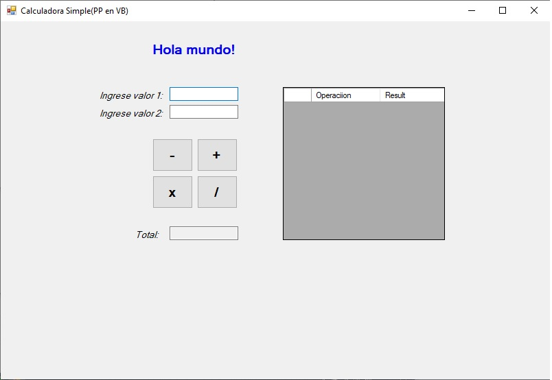
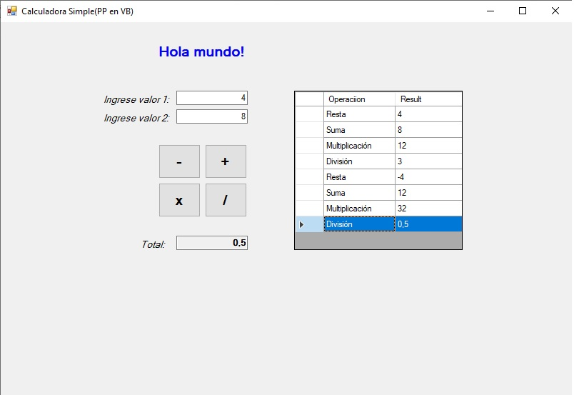

# Calculadora (muy) Simple

Utilizando Net Framework, con el lenguaje Visual Basic cree esta simple calculadora de escritorio.

## Vistas

### Inicio 

### Con datos

## Uso
Para poder usar/probar la aplicación de consola. Descargan el repositorio, abren la carpeta

**IntroVB -> bin -> Debug**

Dentro de la carpeta Debug hacen click en 

**IntroVB.exe**
